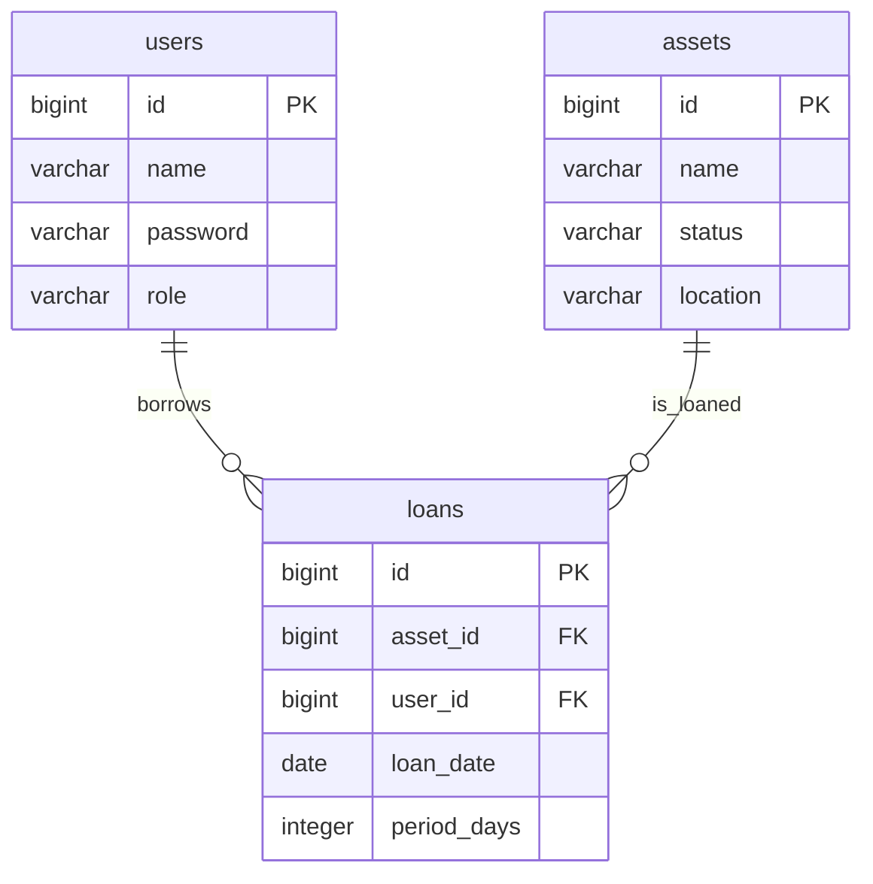

# DB設計

ER図やテーブル定義を記載します。

## ER図 (Mermaid)

## assets

| カラム名 | 型 | 説明 |
|---|---|---|
| id | bigint | 資産ID（主キー、自動採番） |
| name | varchar(100) | 資産名 |
| status | varchar(20) | 状態（`AVAILABLE`: 利用可能, `LOANED`: 貸出中） |
| location | varchar(100) | 保管場所 |

## users

| カラム名 | 型 | 説明 |
|---|---|---|
| id | bigint | ユーザID（主キー、自動採番） |
| name | varchar(100) | ユーザ名 |
| password | varchar(100) | パスワード（ハッシュ化想定） |
| role | varchar(20) | 権限（`ADMIN`: 管理者, `USER`: 一般ユーザ） |

## loans

| カラム名 | 型 | 説明 |
|---|---|---|
| id | bigint | 貸出ID（主キー、自動採番） |
| asset_id | bigint | 資産ID（assetsテーブルへの外部キー） |
| user_id | bigint | ユーザID（usersテーブルへの外部キー） |
| loan_date | date | 貸出日 |
| period_days | integer | 貸出期間（日数） |
